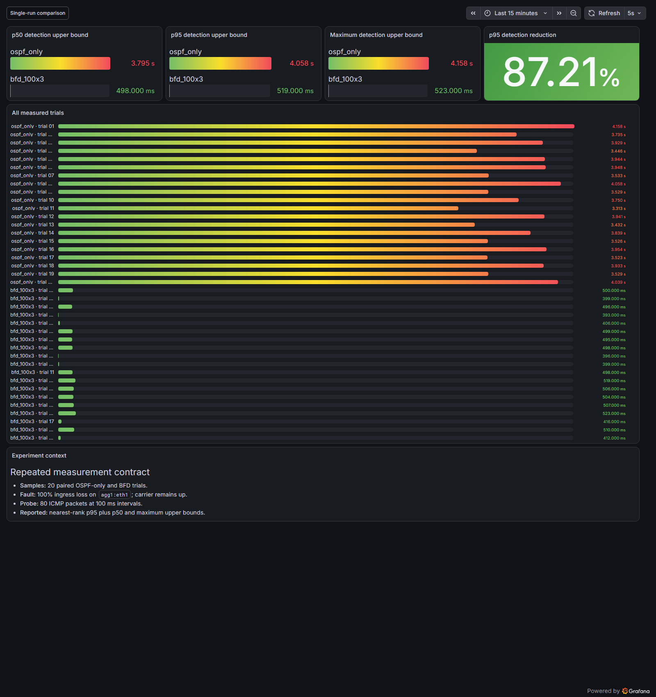
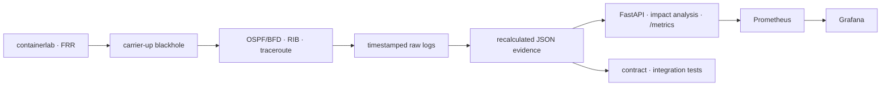
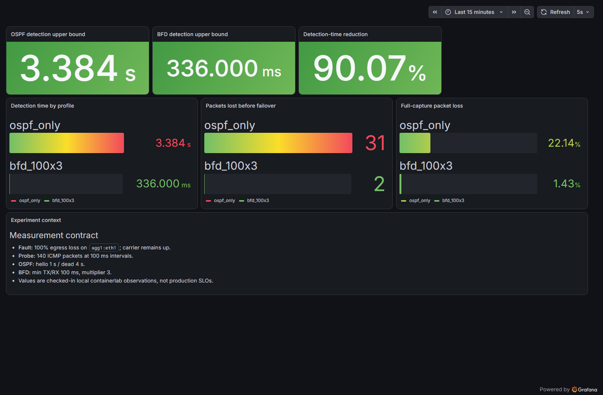

# TelcoNet Sentinel

[](https://github.com/teriyakki-jin/telconet-sentinel/actions/workflows/validate.yml)
[](https://github.com/teriyakki-jin/telconet-sentinel/actions/workflows/codeql.yml)
[](https://scorecard.dev/viewer/?uri=github.com/teriyakki-jin/telconet-sentinel)

**OSPF 이중화 IP망을 직접 설계하고, carrier-up 블랙홀에서 OSPF와 BFD의 장애 탐지 성능을 반복 측정한 네트워크 운영 자동화 프로젝트입니다.**

FRRouting과 containerlab으로 Access–Aggregation–Core 전송망을 구성하고, 장애 전후의 경로·가입자 영향·패킷 손실을 분석합니다. 실험 결과는 원시 로그에서 JSON evidence로 재계산한 뒤 Prometheus와 Grafana로 시각화합니다.

> 개인 포트폴리오용 로컬 시뮬레이션입니다. 실제 통신사 망 구성, 장비, 주소 또는 운영 데이터는 포함하지 않으며 측정값을 상용망 SLO로 주장하지 않습니다.

| 핵심 결과 | OSPF only | BFD 100ms × 3 | 개선 |
|---|---:|---:|---:|
| p50 탐지 상한 | 3,794.5ms | 498ms | 86.88% 단축 |
| p95 탐지 상한 | 4,058ms | 519ms | **87.21% 단축** |
| 최대 탐지 상한 | 4,158ms | 523ms | 87.42% 단축 |
| 반복 표본 | 20회 | 20회 | 총 40회 실측 |



## 프로젝트 한눈에

| 항목 | 내용 |
|---|---|
| 형태 | 개인 프로젝트 |
| 목표 | 장애를 재현하고, 경로 수렴을 계측하며, 결과를 운영 지표와 재현 가능한 근거로 연결 |
| 네트워크 | FRR 라우터 6대, 가입자 단말 2대, 서비스 호스트 1대 |
| 라우팅 | Single Area 0 OSPF, 명시적 cost, `/31` point-to-point transit, `/32` router-id |
| 장애 | 링크 carrier는 유지하고 `agg1:eth1` ingress 패킷을 100% 차단하는 원격 블랙홀 |
| 비교 | OSPF hello/dead 1초/4초 vs BFD minimum TX/RX 100ms, multiplier 3 |
| 구현 범위 | 망 설계, 실험 자동화, 로그 파서, 영향 분석 API, Prometheus, Grafana, 테스트와 CI |
| 검증 | 66개 테스트, branch coverage 85.73%, Ruff, mypy, CodeQL, OpenSSF Scorecard, GitHub Actions |

## 문제 정의

유선/IP Network 엔지니어의 역할은 프로토콜 설정에서 끝나지 않습니다. 장애가 발생했을 때 다음 질문에 근거를 가지고 답할 수 있어야 합니다.

1. 어떤 경로가 정상 경로이며, 장애 후 어떤 경로가 선택되는가?
2. 링크가 물리적으로 Down되지 않는 패킷 블랙홀을 얼마나 빨리 탐지하는가?
3. 장애가 어느 Access 노드와 가입자 prefix에 영향을 주는가?
4. 측정 결과를 다른 사람이 원시 데이터부터 재현할 수 있는가?

TelcoNet Sentinel은 이 네 질문을 하나의 흐름으로 검증합니다.



## OSPF 네트워크 설계

모든 라우터를 Area 0에 배치하고 transit 링크 양 끝에 동일한 cost를 명시했습니다. 자동 cost 대신 primary `10`, backup `100`, inter-core `20`을 사용해 경로 선택을 계산하고 설명할 수 있도록 설계했습니다.

```text
================================================================================
                         OSPF Area 0 Network Architecture
================================================================================

             [ Service Network · 10.20.0.0/24 · Cost 10 · Passive ]
                                   │
                                   ▼
         ┌──────────────────┐   Cost 20   ┌──────────────────┐
         │  core1 · .0.31   ├─────────────┤  core2 · .0.32   │
         └─────┬────────┬───┘             └───┬────────┬─────┘
    Primary 10 │        ╲ Backup 100  Backup 100 ╱        │ Primary 10
               │         ╲                   ╱         │
               ▼          ╲                 ╱          ▼
         ┌──────────────────┐             ┌──────────────────┐
         │  agg1 · .0.21    │             │  agg2 · .0.22    │
         └─────┬────────┬───┘             └───┬────────┬─────┘
    Primary 10 │        ╲ Backup 100  Backup 100 ╱        │ Primary 10
               │         ╲                   ╱         │
               ▼          ╲                 ╱          ▼
         ┌──────────────────┐             ┌──────────────────┐
         │ access1 · .0.11  │             │ access2 · .0.12  │
         └──────────────────┘             └──────────────────┘

Router-ID prefix: 10.255.0.x/32 · Transit links: /31 point-to-point
```

### 경로 선택

```text
정상 경로  : access1 → agg1 → core1 → service
OSPF cost  : 10 + 10 + 10 = 30

장애 우회  : access1 → agg2 → core2 → core1 → service
OSPF cost  : 100 + 10 + 20 + 10 = 140
```

| 설계 선택 | 이유 |
|---|---|
| Single Area 0 | 소규모 랩에서 multi-area 변수를 제외하고 경로 수렴 실험에 집중 |
| `/31` point-to-point | transit 주소를 절약하고 DR/BDR 선출이 불필요한 링크로 명시 |
| Loopback `/32` router-id | 물리 interface 주소와 분리된 안정적인 라우터 식별자 사용 |
| Passive customer/service interface | prefix는 광고하되 단말과 OSPF adjacency를 맺지 않음 |
| Explicit cost 10/100/20 | primary/backup 정책을 대역폭 추정값과 분리하고 결정론적으로 검증 |
| BFD를 탐지 계층으로만 사용 | OSPF 경로 정책을 유지한 상태에서 장애 탐지 성능만 비교 |

전체 주소 계획, router-id, 장애별 예상 경로와 단일 장애점은 [OSPF 설계 문서](docs/OSPF_DESIGN.md)에 정리했습니다.

## 반복 실험 설계

단발 결과의 우연성을 줄이기 위해 OSPF-only와 BFD를 각각 20회 측정했습니다. 매 회차는 이전 상태의 영향을 받지 않도록 다음 조건을 통과해야 시작됩니다.

- OSPF-only: BFD session count `0`, 서비스 경로 metric `30`
- BFD: peer status `up`, 서비스 경로 metric `30`
- 장애: `agg1:eth1`의 carrier는 유지하고 ingress 패킷만 100% drop
- Probe: 100ms 간격 ICMP 80개와 `ping -D` epoch timestamp
- 완료 조건: 서비스 경로 metric `140`, traceroute 우회 경로 관측
- 통계: median p50, nearest-rank p95, maximum

| 프로필 | p50 | p95 | max | 전환 전 손실 p50 | 전환 전 손실 p95 |
|---|---:|---:|---:|---:|---:|
| OSPF only | 3,794.5ms | 4,058ms | 4,158ms | 34.5 packets | 37 packets |
| BFD 100ms × 3 | 498ms | 519ms | 523ms | 3 packets | 3 packets |

### 재현 가능한 evidence

실험 수치는 README에 수동 입력한 값이 아니라 다음 파이프라인으로 생성됩니다.

```text
40개 원시 로그
  → timestamp·ping sequence·TTL·route metric 파싱
  → p50·p95·max 계산
  → configuration SHA-256 검증
  → evidence/bfd-repeated-trials.json
  → FastAPI /metrics
  → Prometheus
  → Grafana
```

- [40개 원시 로그](evidence/repeated)
- [반복 실험 JSON](evidence/bfd-repeated-trials.json)
- [실험 자동화 스크립트](scenarios/bfd_repeated_trials_lab.sh)
- [집계 구현](src/telconet_sentinel/repeated_trials.py)

통합 테스트는 checked-in JSON을 40개 원시 로그에서 다시 계산하고, 모든 profile이 현재 topology·FRR configuration SHA-256을 사용했는지 확인합니다.

<details>
<summary>초기 단발 A/B 실험 결과</summary>

| 프로필 | 탐지 방식 | 경로 전환 상한 | 전환 전 손실 | 전체 캡처 손실 |
|---|---|---:|---:|---:|
| OSPF only | hello 1s / dead 4s | 3,384ms | 31 packets | 22.1429% |
| BFD | min TX/RX 100ms, multiplier 3 | 336ms | 2 packets | 1.42857% |



[원시 로그](evidence/remote-blackhole-bfd.log)와 [비교 JSON](evidence/bfd-comparison.json)도 동일한 방식으로 재계산합니다.

</details>

## 장애 영향 분석

API는 관측된 `link_id`를 입력으로 받아 OSPF cost가 반영된 장애 전후 최단 경로를 비교합니다. 원인을 추측하지 않고, 관측된 장애가 topology에 미치는 영향만 설명합니다.

```json
{
  "failed_component": "access1--agg1",
  "affected_nodes": ["access1"],
  "affected_prefixes": ["10.10.1.0/24"],
  "service_impact": "degraded",
  "recommended_action": {
    "action": "restore_link",
    "target": "access1--agg1"
  },
  "status": "awaiting_approval"
}
```

| 판정 | 조건 |
|---|---|
| `OUTAGE` | 서비스까지 도달 가능한 경로가 사라짐 |
| `DEGRADED` | 서비스 경로는 유지되지만 OSPF cost가 증가 |
| `REDUNDANCY_REDUCED` | 활성 최단 경로는 유지되지만 예비 링크가 감소 |

복구 API는 raw shell command를 받지 않습니다. 현재 허용된 제안은 topology에 존재하는 링크를 대상으로 한 `restore_link`뿐이며, API가 privileged lab command나 Docker socket을 직접 사용하지 않도록 경계를 분리했습니다.

## 실행 방법

### 1. 대시보드 실행

```bash
docker compose up -d --build
```

| 서비스 | URL |
|---|---|
| Grafana | `http://127.0.0.1:3000` |
| 반복 실험 dashboard | `http://127.0.0.1:3000/d/telconet-bfd-repeated-trials` |
| Prometheus | `http://127.0.0.1:9090` |
| Raw metrics | `http://127.0.0.1:8000/metrics` |
| API docs | `http://127.0.0.1:8000/docs` |

모든 포트는 loopback에만 공개합니다. Grafana dashboard와 datasource는 file provisioning하며 anonymous read-only viewer로 실행합니다.

```bash
docker compose down
```

### 2. API와 테스트

```powershell
python -m venv .venv
.venv\Scripts\Activate.ps1
python -m pip install -e ".[dev]"
pytest -q --cov=telconet_sentinel --cov-branch --cov-fail-under=80
uvicorn telconet_sentinel.main:app --reload
```

```bash
curl -X POST http://127.0.0.1:8000/api/events \
  -H 'content-type: application/json' \
  -d '{"event_type":"link_down","link_id":"access1--agg1"}'
```

### 3. 실제 라우팅 실험

containerlab은 Linux network namespace를 사용하므로 Windows에서는 WSL2 안에서 실행합니다.

```bash
python -m pip install -e .
bash scenarios/link_failure_lab.sh
bash scenarios/bfd_comparison_lab.sh
bash scenarios/bfd_repeated_trials_lab.sh
```

반복 실험은 기본 20회이며 `TELCONET_TRIALS`로 20~30회 범위에서 조정할 수 있습니다.

## 검증과 품질

| 계층 | 검증 내용 |
|---|---|
| Unit | OSPF/BFD 로그 파싱, p50/p95/max, topology·impact·recovery 로직 |
| API | typed request, 영향 분석 응답, 중복 제거, 승인 상태 전이, Prometheus metrics |
| Contract | intent–containerlab 링크 일치, FRR image/capability, OSPF cost/timer/router-id, dashboard query |
| Integration | 원시 로그에서 evidence 재계산, configuration fingerprint 일치 |
| Static | Ruff, strict mypy, Bash syntax |
| Security | CodeQL `security-extended` query로 Python 취약점·오류 분석 |
| Supply chain | OpenSSF Scorecard로 dependency pinning·token permission·CI 관행 평가 |
| CI | push·pull request마다 66개 테스트와 branch coverage 80% gate 실행 |

현재 검증 결과는 **66 tests passed, branch coverage 85.73%**입니다. CodeQL과
OpenSSF Scorecard 결과는 README 상단의 배지에서 최신 실행 상태와 공개 평가를 확인할 수 있습니다.

## 저장소 구조

```text
telconet-sentinel/
├── lab/                       # containerlab topology, intent, FRR configs
├── scenarios/                 # carrier-down·blackhole·반복 실험 자동화
├── evidence/                  # raw logs와 재계산된 JSON evidence
├── src/telconet_sentinel/     # impact analysis, API, parsers, metrics
├── observability/             # Prometheus와 Grafana provisioning
├── tests/                     # unit·API·contract·integration tests
└── docs/                      # OSPF 설계, architecture, runbook
```

## 설계 범위와 다음 단계

현재 결과는 격리된 로컬 containerlab 관측값이며 상용망 성능을 대표하지 않습니다.

- Single Area 0이며 multi-area, BGP, MPLS L3VPN은 포함하지 않음
- 서비스망이 core1에만 연결되어 service-facing link와 core1이 단일 장애점
- 실시간 FRR syslog·neighbor exporter와 alert는 아직 연결하지 않음
- OSPF authentication, 장기 부하, 장비 vendor 간 interoperability는 검증하지 않음
- 승인 API는 로컬 typed state transition이며 운영자 인증과 실제 복구 실행기는 아님

다음 단계는 `blackhole 주입 → BFD Down → OSPF Neighbor Down → RIB metric 30→140 → ICMP 복구`를 하나의 control-plane 타임라인으로 수집해 Grafana에 표시하는 것입니다.

## 기술 스택과 문서

- Network: containerlab 0.79.0, FRRouting 10.7.0, OSPF, BFD
- Backend: Python, FastAPI, Pydantic
- Observability: Prometheus 3.14.0, Grafana 13.1.0
- Quality: pytest, coverage, Ruff, mypy, CodeQL, OpenSSF Scorecard, GitHub Actions
- Packaging: Docker, Docker Compose

상세 문서:

- [OSPF 설계](docs/OSPF_DESIGN.md)
- [시스템 아키텍처와 신뢰 경계](docs/ARCHITECTURE.md)
- [링크 장애 실험 Runbook](docs/RUNBOOK_LINK_FAILURE.md)

BFD와 OSPF 설정은 [FRRouting BFD 문서](https://docs.frrouting.org/en/latest/bfd.html)와 [FRRouting OSPF 문서](https://docs.frrouting.org/en/latest/ospfd.html)를 기준으로 작성했습니다.
