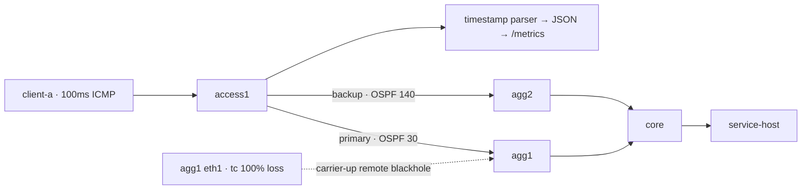

# TelcoNet Sentinel

통신사형 Access–Aggregation–Core IP 전송망을 로컬에서 모사하고, 링크 장애의 원인과 가입자 영향 범위를 설명한 뒤 승인 가능한 복구 계획을 생성하는 네트워크 운영 자동화 프로젝트입니다.

> 이 저장소는 학습 및 포트폴리오 목적의 시뮬레이션입니다. 실제 통신사 망 구성·장비·주소·운영 데이터는 포함하지 않습니다.

## 왜 만들었나

유선/IP Infra 엔지니어는 망을 설계·구축하는 데서 끝나지 않고 장비와 선로의 장애를 모니터링하고, 원인과 서비스 영향을 판단하며, 재발 방지 가능한 운용 절차를 만들어야 합니다. 이 프로젝트는 단순 CPU 임계치 대시보드가 아니라 다음 역량을 한 흐름으로 검증합니다.

- OSPF 기반 이중화 IP망 설계
- 링크 장애와 우회 경로 분석
- OSPF cost 기반 topology-aware impact analysis
- 영향받는 Access 노드와 가입자 prefix 계산
- 임의 명령 실행을 차단한 승인형 복구 절차
- 테스트 및 JSON evidence 기반 재현성

## 동작 흐름

```text
FRR 라우터 6대 + 가입자 단말 2대 + Core 뒤 서비스 호스트
              ↓ link event
FastAPI Incident Service
              ↓
Topology-aware impact analysis
              ↓
원인 링크 · 영향 노드 · 가입자 Prefix · 서비스 영향
              ↓
승인 대기 중인 restore_link 계획
```

## 현재 검증 상태

- 단위·API·랩 계약·evidence 테스트 56개, branch coverage 87.63%
- 6-router OSPF 구성과 containerlab 선언을 계약 테스트로 검증
- `access1--agg1` 장애 시 Core 뒤 서비스까지 대체 경로와 `DEGRADED` 판정 검증
- containerlab 0.79.0 + FRR 10.7.0에서 실제 9-node 랩 기동 검증
- 실제 링크-down 실험과 OSPF/BFD 원격 블랙홀 A/B 실험을 원시 로그부터 재계산
- BFD 100ms × 3 적용 시 관측 경로 전환 상한 3.384초 → 336ms(90.07% 단축)
- 전환 전 손실 패킷 31개 → 2개(93.55% 감소), 동일 140패킷 캡처 손실 22.1429% → 1.42857%

분석 예시는 `scenario_injected_event`, 실험 결과는 `containerlab_observation`으로 분리합니다. [링크-down 원시 로그](evidence/measured-link-failure.log)와 [BFD 비교 원시 로그](evidence/remote-blackhole-bfd.log)를 파서가 각각 [측정 JSON](evidence/measured-link-failure.json)과 [비교 JSON](evidence/bfd-comparison.json)으로 재계산하며, 테스트에서 결과 일치를 검증합니다.



| 프로필 | 탐지 방식 | 경로 전환 상한 | 전환 전 손실 | 전체 캡처 손실 |
|---|---|---:|---:|---:|
| OSPF only | hello 1s / dead 4s | 3,384ms | 31 packets | 22.1429% |
| BFD | min tx/rx 100ms, multiplier 3 | 336ms | 2 packets | 1.42857% |

## 빠른 시작

### 분석 API와 테스트

```powershell
python -m venv .venv
.venv\Scripts\Activate.ps1
python -m pip install -e ".[dev]"
pytest -q --cov=telconet_sentinel --cov-branch --cov-fail-under=80
uvicorn telconet_sentinel.main:app --reload
```

API 문서는 `http://127.0.0.1:8000/docs`에서 확인할 수 있습니다.

```bash
curl -X POST http://127.0.0.1:8000/api/events \
  -H 'content-type: application/json' \
  -d '{"event_type":"link_down","link_id":"access1--agg1"}'
```

주요 엔드포인트:

| Method | Path | 목적 |
|---|---|---|
| GET | `/health` | API 상태 확인 |
| GET | `/metrics` | 최신 A/B 실험의 Prometheus 지표 |
| GET | `/api/topology` | 노드·링크·가입자 prefix 확인 |
| POST | `/api/events` | 장애 이벤트 분석 및 중복 제거 |
| GET | `/api/incidents/{id}` | 장애 분석 결과 확인 |
| POST | `/api/incidents/{id}/approve` | 고정 복구 계획 승인 |

### 시나리오 evidence 생성

```powershell
python -m telconet_sentinel.demo `
  --link access1--agg1 `
  --output evidence/simulated-link-failure.json
```

### 실제 라우팅 랩

containerlab은 Linux 네트워크 기능을 사용하므로 Windows에서는 WSL2 안에서 실행합니다.

```bash
python -m pip install -e .
bash scenarios/link_failure_lab.sh
bash scenarios/bfd_comparison_lab.sh
```

첫 스크립트는 로컬 carrier-down 복구를, 두 번째 스크립트는 carrier는 유지한 채 `tc netem`으로 원격 패킷 블랙홀을 만들고 OSPF only/BFD를 같은 조건에서 비교합니다. 이벤트 epoch와 `iputils ping -D` 응답 timestamp를 비교해 경로 전환 상한을 계산하며 topology·intent·FRR configuration SHA-256도 남기므로 수치를 수동으로 입력하지 않습니다.

앱은 비교 JSON을 읽어 `telconet_detection_seconds`, `telconet_failover_lost_packets`, `telconet_capture_packet_loss_ratio`를 `/metrics`에 노출합니다. Docker 이미지에도 검증된 evidence가 포함됩니다.

BFD 설정 문법과 세션 동작은 [FRRouting BFD 공식 문서](https://docs.frrouting.org/en/latest/bfd.html), OSPF timer와 interface 동작은 [FRRouting OSPF 공식 문서](https://docs.frrouting.org/en/latest/ospfd.html)를 기준으로 했습니다.

### 관측 대시보드

```powershell
docker compose up -d --build
```

- Grafana: `http://127.0.0.1:3000` — 로그인 없이 read-only viewer로 비교 dashboard가 바로 열림
- Prometheus: `http://127.0.0.1:9090`
- Raw metrics: `http://127.0.0.1:8000/metrics`

Grafana에는 OSPF/BFD 탐지 상한, 탐지시간 감소율, 전환 전 손실 패킷, 전체 캡처 손실률, 실험 조건을 담은 7개 패널을 파일 provisioning합니다. 모든 포트는 loopback에만 공개하며 dashboard와 datasource는 UI에서 수정할 수 없습니다.

```powershell
docker compose down
```

구성 방식은 [Prometheus scrape configuration](https://prometheus.io/docs/prometheus/latest/configuration/configuration/)과 [Grafana provisioning](https://grafana.com/docs/grafana/latest/administration/provisioning/) 공식 문서를 따릅니다.

상세 검증 순서는 [링크 장애 Runbook](docs/RUNBOOK_LINK_FAILURE.md)에 있습니다.

## 설계 포인트

### 설명 가능한 영향 분석

장애 이벤트는 관측된 실패 링크를 입력으로 받으며, 링크 자체의 원인을 추론한다고 주장하지 않습니다. 대신 Dijkstra 기반으로 OSPF cost를 반영한 장애 전후 최단 서비스 경로를 비교합니다. 경로가 사라지면 `OUTAGE`, cost가 증가하면 `DEGRADED`, 활성 최단 경로는 유지되지만 예비 링크만 줄어들면 `REDUNDANCY_REDUCED`로 구분합니다.

### 안전한 복구 경계

API는 raw shell command를 받지 않습니다. Phase 1에서 가능한 동작은 기존 topology link에 대한 `restore_link`뿐이며, 승인 API는 인증된 운영자 승인 기능이 아닌 로컬 typed state transition입니다. 실제 실행기와 연결하지 않았고, 권한이 필요한 containerlab 명령은 별도 로컬 Runbook에서 실행합니다.

중복 판단은 클라이언트 timestamp가 아니라 서버 monotonic clock의 60초 창을 사용하고, 인메모리 incident는 최대 1,000개로 제한합니다. 외부 `observed_at`은 timezone 정보가 있을 때만 evidence로 보존됩니다.

### 단일 기준과 계약 테스트

- `lab/intent.yml`: 영향 분석용 노드·역할·링크 cost·가입자 prefix의 기준
- `lab/telconet.clab.yml`: 실제 에뮬레이션 링크와 컨테이너의 기준
- 계약 테스트: 두 선언의 링크 일치, 이미지 버전 태그, 최소 컨테이너 권한, OSPF 설정과 Router ID 검증

FRR 이미지는 현재 `10.7.0` 태그로 고정했습니다. 실제 랩 pull 검증 후에는 registry digest까지 고정할 예정입니다.

FRR 10.7 컨테이너의 `zebra`와 `ospfd`가 요구하는 capability 때문에 라우터에 `NET_ADMIN`, `NET_RAW`, `SYS_ADMIN`을 부여합니다. 컨테이너는 privileged 모드가 아니며 FRR 설정 bind는 읽기 전용입니다. 이 권한 모델은 격리된 로컬 실험용이며 운영 환경 배포를 전제로 하지 않습니다.

아키텍처와 신뢰 경계는 [ARCHITECTURE.md](docs/ARCHITECTURE.md)에 정리했습니다.

## 다음 단계

1. FRR syslog에서 링크 이벤트를 수집해 scenario injection과 실제 탐지를 분리
2. 반복 실험과 백분위수로 BFD 수렴 분포·변동성 검증
3. BGP 및 MPLS L3VPN 추가
4. 실시간 FRR interface·neighbor metric exporter와 Grafana alert 추가
5. FRR syslog 실시간 수집과 MTTR·오탐률 측정

## 기술 스택

- Network lab: containerlab, FRRouting, OSPF
- Backend: Python, FastAPI, Pydantic
- Observability: Prometheus 3.14.0, Grafana 13.1.0, file provisioning
- Validation: pytest, coverage, Ruff, mypy, GitHub Actions
- Packaging: Docker, Docker Compose
