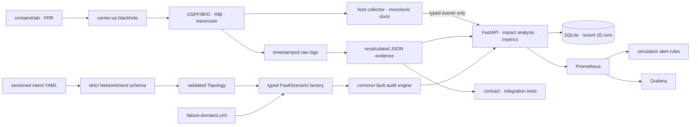
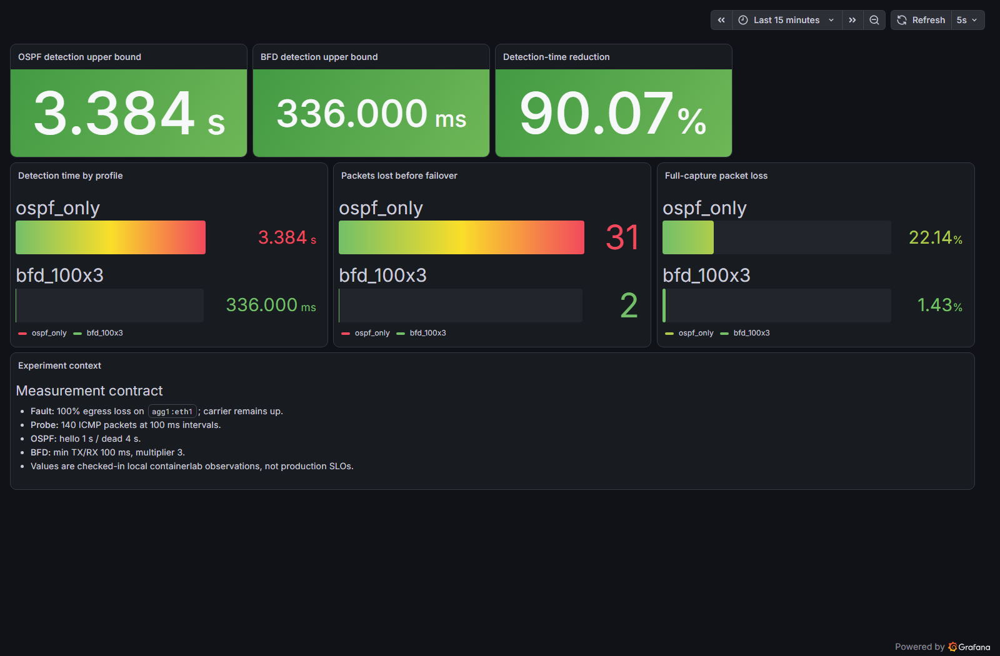

# TelcoNet Sentinel

[](https://github.com/teriyakki-jin/telconet-sentinel/actions/workflows/validate.yml)
[](https://github.com/teriyakki-jin/telconet-sentinel/actions/workflows/lab-e2e.yml)
[](https://github.com/teriyakki-jin/telconet-sentinel/actions/workflows/codeql.yml)
[](https://scorecard.dev/viewer/?uri=github.com/teriyakki-jin/telconet-sentinel)

FRRouting과 containerlab으로 Access–Aggregation–Core 형태의 OSPF 망을 구성했다. 링크 상태는 살아 있지만 패킷만 버려지는 블랙홀 장애를 주입하고, OSPF 단독 구성과 BFD 연동 구성의 탐지 시간을 비교한다. 원시 로그, 경로 영향 분석, Prometheus 지표와 Grafana 대시보드까지 한 저장소에서 재현할 수 있도록 만들었다.

이 저장소는 개인 학습용 로컬 시뮬레이션이다. 실제 통신사 망 정보나 운영 데이터는 사용하지 않았으며, 아래 수치는 이 랩 환경에서 관측한 값이다.

| 핵심 결과 | OSPF only | BFD 100ms × 3 | 개선 |
|---|---:|---:|---:|
| p50 탐지 상한 | 3,794.5ms | 498ms | 86.88% 단축 |
| p95 탐지 상한 | 4,058ms | 519ms | 87.21% 단축 |
| 최대 탐지 상한 | 4,158ms | 523ms | 87.42% 단축 |
| 반복 표본 | 20회 | 20회 | 총 40회 측정 |


## 구성

| 항목 | 내용 |
|---|---|
| 목표 | 장애 재현, 경로 수렴 계측, 영향 분석, 결과 시각화 |
| 네트워크 | FRR 라우터 6대, 가입자 단말 2대, 서비스 호스트 1대 |
| 라우팅 | Single Area 0 OSPF, 명시적 cost, `/31` point-to-point transit, `/32` router-id |
| 장애 | 링크 carrier는 유지하고 `agg1:eth1` ingress 패킷을 100% 차단하는 원격 블랙홀 |
| 비교 | OSPF hello/dead 1초/4초 vs BFD minimum TX/RX 100ms, multiplier 3 |
| 구현 범위 | 망 설계, 링크·노드·SRLG 분석, 실험 자동화, 수렴 수집기, SQLite, Prometheus, Grafana |
| 검증 | containerlab E2E, pytest, Ruff, mypy, promtool, CodeQL |

## 확인하려는 것

출발점은 아래 네 가지였다.

1. 어떤 경로가 정상 경로이며, 장애 후 어떤 경로가 선택되는가?
2. 링크가 물리적으로 Down되지 않는 패킷 블랙홀을 얼마나 빨리 탐지하는가?
3. 장애가 어느 Access 노드와 가입자 prefix에 영향을 주는가?
4. README의 수치를 원시 로그에서 다시 계산할 수 있는가?


```mermaid
flowchart LR
    LAB["containerlab · FRR"] --> FAULT["carrier-up blackhole"]
    FAULT --> STATE["OSPF/BFD · RIB · traceroute"]
    STATE --> RAW["timestamped raw logs"]
    STATE --> COLLECTOR["host collector · monotonic clock"]
    COLLECTOR -->|"typed events only"| API
    RAW --> JSON["recalculated JSON evidence"]
    JSON --> API["FastAPI · impact analysis · /metrics"]
    INTENT["versioned intent YAML"] --> SCHEMA["strict NetworkIntent schema"]
    SCHEMA --> GRAPH["validated Topology"]
    GRAPH --> SCENARIO["typed FaultScenario factory"]
    FD["failure-domains.yml"] --> SCENARIO
    SCENARIO --> AUDIT["common fault audit engine"]
    AUDIT --> API
    API --> DB[("SQLite · recent 20 runs")]
    API --> PROM["Prometheus"]
    PROM --> ALERT["simulation alert rules"]
    PROM --> GRAFANA["Grafana"]
    JSON --> TEST["contract · integration tests"]
```

## 코드 구조

YAML 로딩, 장애 정의, 경로 계산, API 응답을 분리했다.

| 계층 | 책임 |
|---|---|
| `intent.py` | version 1 YAML을 Pydantic 모델로 검증하고 `Topology`로 변환 |
| `designs.yml` | baseline과 candidate 관계를 선언 |
| `fault.py` | 단일 링크·단일 노드·복합 장애를 `FaultScenario`로 표현 |
| `audit.py` | 정상 경로와 장애 후 경로를 비교해 공통 `FaultAuditResult` 생성 |
| `failure_domain.py` | SRLG 정의를 검증하고 복합 장애 결과와 지표를 생성 |
| `resilience.py` | 링크·노드 N-1 결과를 API와 Prometheus 형식으로 변환 |

잘못된 schema version, 중복 ID, 존재하지 않는 endpoint, self-link, 비정상 prefix는 로딩할 때 거부한다. 링크·노드·SRLG 감사는 같은 경로 계산 코드를 사용한다. 자세한 입력 규칙은 [Intent와 fault model 문서](docs/INTENT_MODEL.md)에 정리했다.

## OSPF 네트워크 설계

라우터는 모두 Area 0에 두었다. 자동 cost 대신 primary `10`, backup `100`, inter-core `20`을 지정해 정상 경로와 우회 경로가 매번 같도록 했다.

```text
================================================================================
                         OSPF Area 0 Network Architecture
================================================================================

             [ Service Network · 10.20.0.0/24 · Cost 10 · Passive ]
                                   │
                                   ▼
         ┌──────────────────┐   Cost 20   ┌──────────────────┐
         │  core1 · .0.31   ├─────────────┤  core2 · .0.32   │
         └─────┬────────┬───┘             └───┬────────┬─────┘
    Primary 10 │        ╲ Backup 100  Backup 100 ╱        │ Primary 10
               │         ╲                   ╱         │
               ▼          ╲                 ╱          ▼
         ┌──────────────────┐             ┌──────────────────┐
         │  agg1 · .0.21    │             │  agg2 · .0.22    │
         └─────┬────────┬───┘             └───┬────────┬─────┘
    Primary 10 │        ╲ Backup 100  Backup 100 ╱        │ Primary 10
               │         ╲                   ╱         │
               ▼          ╲                 ╱          ▼
         ┌──────────────────┐             ┌──────────────────┐
         │ access1 · .0.11  │             │ access2 · .0.12  │
         └──────────────────┘             └──────────────────┘

Router-ID prefix: 10.255.0.x/32 · Transit links: /31 point-to-point
```

### 경로 선택

```text
정상 경로  : access1 → agg1 → core1 → service
OSPF cost  : 10 + 10 + 10 = 30

장애 우회  : access1 → agg2 → core2 → core1 → service
OSPF cost  : 100 + 10 + 20 + 10 = 140
```

| 설계 선택 | 이유 |
|---|---|
| Single Area 0 | 소규모 랩에서 multi-area 변수를 제외하고 경로 수렴 실험에 집중 |
| `/31` point-to-point | transit 주소를 절약하고 DR/BDR 선출이 불필요한 링크로 명시 |
| Loopback `/32` router-id | 물리 interface 주소와 분리된 안정적인 라우터 식별자 사용 |
| Passive customer/service interface | prefix는 광고하되 단말과 OSPF adjacency를 맺지 않음 |
| Explicit cost 10/100/20 | primary/backup 정책을 대역폭 추정값과 분리하고 결정론적으로 검증 |
| BFD를 탐지 계층으로만 사용 | OSPF 경로 정책을 유지한 상태에서 장애 탐지 성능만 비교 |

주소 계획과 장애별 예상 경로는 [OSPF 설계 문서](docs/OSPF_DESIGN.md)에 정리했다.

## N-1 링크·전송 노드 장애 전수 분석과 서비스 이중화

`intent.yml`의 링크를 하나씩 제외하고 각 Access 노드에서 서비스까지의 최단 경로를 다시 계산한다. 아래 표는 baseline 설계의 10개 링크를 검사한 결과다.

| 판정 | 시나리오 수 | 의미 |
|---|---:|---|
| `OUTAGE` | **1** | 서비스 경로 소실 |
| `DEGRADED` | 5 | 우회 가능하지만 최단 경로 cost 증가 |
| `REDUNDANCY_REDUCED` | 4 | 활성 최단 경로는 유지되지만 예비 링크 감소 |
| 합계 | 10 | 모든 링크를 한 번씩 제외 |

기존 설계는 `core1--service-host`가 끊기면 두 Access 노드 모두 서비스에 도달하지 못한다. 이 문제를 확인한 뒤 `core2--service-host`를 추가한 `intent-dual-homed.yml`을 별도로 만들었다. 후보 설계에서는 11개 단일 링크 장애 중 `OUTAGE`가 발생하지 않았다.

전송 노드도 같은 방법으로 확인했다. 기존 설계는 `core1` 장애에서 서비스 경로가 사라지고, 후보 설계는 `agg1`, `agg2`, `core1`, `core2` 중 하나를 제거해도 서비스 경로가 남는다.

후보 설계용 containerlab에서도 같은 장애를 실행한다. `core1--service-host`를 내리면 access1의 metric이 `30 → 70 → 30`, `core1`의 전송 인터페이스를 모두 내리면 `30 → 140 → 30`으로 변한다. 두 경우 모두 access1과 access2에서 서비스 VIP `10.20.0.10/32`로 ICMP가 다시 도달하는지 확인한다.

이 검증은 경로 전환과 복구 여부를 확인한다. 무손실 전환이나 일반 서버의 이중 NIC 구성, 물리 경로 분리까지 검증하는 실험은 아니다.

```bash
curl http://127.0.0.1:8000/api/resilience/single-link-failures
curl http://127.0.0.1:8000/api/resilience/single-link-failures/candidate
curl http://127.0.0.1:8000/api/resilience/single-node-failures
curl http://127.0.0.1:8000/api/resilience/single-node-failures/candidate
bash scenarios/dual_homing_e2e.sh
```

세부 결과는 [N-1 설계 감사 문서](docs/N1_DESIGN_AUDIT.md)와 [N-1 Resilience Dashboard](http://127.0.0.1:3000/d/telconet-n1-resilience)에서 볼 수 있다.


## SRLG·Failure Domain 복합 장애 분석

N-1 통과만으로 두 경로가 물리적으로 분리됐다고 볼 수는 없다. `failure-domains.yml`에 함께 소실될 링크와 노드를 정의하고 복합 장애로 다시 계산했다. 파일에 기록된 설계 ID와 topology SHA-256이 `designs.yml` 및 후보 설계와 다르면 실행을 중단한다.

| Failure Domain | 선언된 공통 장애 | 결과 | 경로 변화 |
|---|---|---|---|
| `primary-site-power` | `agg1`, `core1` 동시 손실 | `DEGRADED` | access1 `30 → 140`, access2 `50 → 50` |
| `service-entry` | 두 service-facing 링크 동시 단절 | **`OUTAGE`** | access1·access2 `→ unreachable` |

후보 설계는 단일 링크 11개와 전송 노드 4개 장애는 통과했지만, `service-entry`에 묶인 링크가 함께 끊기면 서비스 경로를 잃는다. Failure domain은 분석을 위해 선언한 가정이며, 실제 관로나 전원 구성을 조사한 결과는 아니다.

```bash
curl http://127.0.0.1:8000/api/resilience/failure-domains/candidate
curl http://127.0.0.1:8000/metrics | grep telconet_srlg
```

[SRLG 설계 감사 문서](docs/SRLG_DESIGN_AUDIT.md)와 [Shared-Risk Resilience Dashboard](http://127.0.0.1:3000/d/telconet-srlg-resilience)에 시나리오별 결과를 정리했다. [failure-domain-audit.json](evidence/failure-domain-audit.json)은 측정 데이터가 아니므로 `measured: false`로 표시했고, 통합 테스트에서 입력 YAML로 다시 계산한다.

## 반복 실험 설계

OSPF-only와 BFD를 각각 20회 측정했다. 매 회차는 아래 초기 상태를 확인한 뒤 시작한다.

- OSPF-only: BFD session count `0`, 서비스 경로 metric `30`
- BFD: peer status `up`, 서비스 경로 metric `30`
- 장애: `agg1:eth1`의 carrier는 유지하고 ingress 패킷만 100% drop
- Probe: 100ms 간격 ICMP 80개와 `ping -D` epoch timestamp
- 완료 조건: 서비스 경로 metric `140`, traceroute 우회 경로 관측
- 통계: median p50, nearest-rank p95, maximum

| 프로필 | p50 | p95 | max | 전환 전 손실 p50 | 전환 전 손실 p95 |
|---|---:|---:|---:|---:|---:|
| OSPF only | 3,794.5ms | 4,058ms | 4,158ms | 34.5 packets | 37 packets |
| BFD 100ms × 3 | 498ms | 519ms | 523ms | 3 packets | 3 packets |

### 재현 가능한 evidence

집계값은 다음 순서로 만든다.

```text
40개 원시 로그
  → timestamp·ping sequence·TTL·route metric 파싱
  → p50·p95·max 계산
  → configuration SHA-256 검증
  → evidence/bfd-repeated-trials.json
  → FastAPI /metrics
  → Prometheus
  → Grafana
```

- [40개 원시 로그](evidence/repeated)
- [반복 실험 JSON](evidence/bfd-repeated-trials.json)
- [실험 자동화 스크립트](scenarios/bfd_repeated_trials_lab.sh)
- [집계 구현](src/telconet_sentinel/repeated_trials.py)

통합 테스트는 체크인된 JSON을 40개 원시 로그에서 다시 계산하고, topology와 FRR 설정의 SHA-256도 비교한다.

## 실시간 control-plane 수렴 타임라인

한 번의 장애에서 control plane과 data plane이 어떤 순서로 바뀌는지도 따로 수집한다. 호스트 수집기가 FRR JSON과 연속 ICMP를 100ms 간격으로 확인하고, 장애 주입 시점부터의 monotonic offset을 API에 기록한다.

```text
blackhole_injected (0ms)
  → bfd_down
  → ospf_neighbor_down
  → route_failover (metric 30 → 140)
  → data_plane_recovered (RIB failover 확인 뒤 최초 ICMP 응답)
```

이 값은 프로토콜 내부 처리시간이 아니라 100ms polling으로 확인한 관측 상한이다. API는 container나 Docker socket에 접근하지 않으며 `event`, `offset_ms`, `route_metric`, `icmp_sequence`만 받는다.

수렴 run과 event는 SQLite named volume에 최근 20건만 보관한다. 컨테이너가 재시작돼도 마지막 타임라인을 조회할 수 있지만 장기 보관용 저장소는 아니다.

### 측정 계층과 검증 결과

| 계층 | 시간 기준 | 용도 |
|---|---|---|
| Convergence timeline | collector의 monotonic clock, fault 직전부터 FRR·ping 관측 직후까지 | BFD·OSPF·RIB·ICMP의 인과 순서와 sub-second 지연 측정 |
| Prometheus·Grafana | `/metrics`를 1초마다 scrape | 최신 run 상태와 단계별 offset을 운영 대시보드에서 시계열로 관찰 |

Sub-second 값은 Prometheus sample 간격으로 계산하지 않는다. 수렴 시간 계산에는 collector의 원본 event offset을 사용하고, Prometheus와 [Live Convergence Dashboard](http://127.0.0.1:3000/d/telconet-live-convergence)는 결과 조회에 사용한다.

Prometheus alert는 API scrape 실패, 미완료 수렴, data-plane 미복구가 20초 동안 이어질 때 firing된다. 이 시간은 로컬 랩에서 상태 지속 여부를 확인하기 위한 값이며 SLO가 아니다. 규칙은 CI에서 `promtool`로 검사한다.

[main containerlab E2E run](https://github.com/teriyakki-jin/telconet-sentinel/actions/runs/34012546439)에서 기록한 값은 다음과 같다.

| 결과 | 관측 상한 |
|---|---:|
| fault 주입 → BFD·OSPF Down 및 backup route metric 140 확인 | 799ms |
| RIB failover 확인 후 최초 ICMP 응답 | 1,080ms |

> `799ms`와 `1,080ms`는 해당 CI 실행에서 얻은 관측 상한이다. 사용한 조건은 FRR 10.7.0, BFD 100ms × 3, OSPF 설정, 100ms polling이며 실서비스 SLA로 일반화할 수 없다.

<details>
<summary>초기 단발 A/B 실험 결과</summary>

| 프로필 | 탐지 방식 | 경로 전환 상한 | 전환 전 손실 | 전체 캡처 손실 |
|---|---|---:|---:|---:|
| OSPF only | hello 1s / dead 4s | 3,384ms | 31 packets | 22.1429% |
| BFD | min TX/RX 100ms, multiplier 3 | 336ms | 2 packets | 1.42857% |



[원시 로그](evidence/remote-blackhole-bfd.log)와 [비교 JSON](evidence/bfd-comparison.json)도 같은 방식으로 재계산된다.

</details>

## 장애 영향 분석

API는 `link_id`를 받아 장애 전후 최단 경로를 비교한다. 장애 원인을 추정하지 않고, 선언된 topology에서 확인되는 영향만 반환한다.

```json
{
  "failed_component": "access1--agg1",
  "affected_nodes": ["access1"],
  "affected_prefixes": ["10.10.1.0/24"],
  "service_impact": "degraded",
  "recommended_action": {
    "action": "restore_link",
    "target": "access1--agg1"
  },
  "status": "awaiting_approval"
}
```

| 판정 | 조건 |
|---|---|
| `OUTAGE` | 서비스까지 도달 가능한 경로가 사라짐 |
| `DEGRADED` | 서비스 경로는 유지되지만 OSPF cost가 증가 |
| `REDUNDANCY_REDUCED` | 활성 최단 경로는 유지되지만 예비 링크가 감소 |

복구 API는 shell command를 받지 않는다. 현재 허용하는 동작은 topology에 존재하는 링크를 대상으로 한 `restore_link`뿐이다. 실제 lab 명령과 Docker socket은 API 밖에 둔다.

## 실행 방법

### 1. 대시보드 실행

```bash
docker compose up -d --build
```

| 서비스 | URL |
|---|---|
| Grafana | `http://127.0.0.1:3000` |
| 반복 실험 dashboard | `http://127.0.0.1:3000/d/telconet-bfd-repeated-trials` |
| Live convergence dashboard | `http://127.0.0.1:3000/d/telconet-live-convergence` |
| N-1 resilience dashboard | `http://127.0.0.1:3000/d/telconet-n1-resilience` |
| Shared-risk resilience dashboard | `http://127.0.0.1:3000/d/telconet-srlg-resilience` |
| Prometheus | `http://127.0.0.1:9090` |
| Prometheus alerts | `http://127.0.0.1:9090/alerts` |
| Raw metrics | `http://127.0.0.1:8000/metrics` |
| API docs | `http://127.0.0.1:8000/docs` |

포트는 모두 loopback에만 연다. Grafana dashboard와 datasource는 파일로 provisioning하고 anonymous read-only viewer로 실행한다. SQLite 파일은 `telconet-state` volume에 남으므로 `docker compose down`만으로는 삭제되지 않는다.

```bash
docker compose down
```

### 2. API와 테스트

```powershell
python -m venv .venv
.venv\Scripts\Activate.ps1
python -m pip install -e ".[dev]"
pytest -q --cov=telconet_sentinel --cov-branch --cov-fail-under=80
uvicorn telconet_sentinel.main:app --reload
```

```bash
curl -X POST http://127.0.0.1:8000/api/events \
  -H 'content-type: application/json' \
  -d '{"event_type":"link_down","link_id":"access1--agg1"}'
```

### 3. 실제 라우팅 실험

containerlab은 Linux network namespace를 사용하므로 Windows에서는 WSL2에서 실행한다.

```bash
python -m pip install -e .
bash scenarios/link_failure_lab.sh
bash scenarios/bfd_comparison_lab.sh
bash scenarios/bfd_repeated_trials_lab.sh
bash scenarios/live_convergence_e2e.sh
```

반복 실험은 기본 20회이며 `TELCONET_TRIALS`로 20~30회 범위에서 바꿀 수 있다. Live E2E 스크립트는 랩 배포부터 blackhole 주입, 수렴 수집, evidence 검증, 정리까지 수행한다. 결과는 `artifacts/live-convergence/`에 저장된다.

## 검증과 품질

| 계층 | 검증 내용 |
|---|---|
| Unit | intent/catalog 입력 검증, 공통 fault engine, SRLG와 경로 cost, OSPF/BFD JSON 파싱, 링크·노드 N-1 분석, SQLite 보존성 |
| API | 링크·노드·failure-domain 감사 응답, 제한된 입력 모델, 재시작 후 수렴 event 조회, 승인 상태 전이, Prometheus metrics |
| Contract | intent–containerlab 링크 일치, FRR image/capability, OSPF 설정, N-1·SRLG·live dashboard, alert rule·E2E workflow |
| Integration | 원시 로그에서 evidence 재계산, configuration fingerprint 일치 |
| Lab E2E | 실제 FRR에서 blackhole 수렴, 이중 서비스 링크, core1 격리, RIB 전환, 양쪽 client ICMP 복구 검증 |
| Static | Ruff, strict mypy, Bash syntax |
| Security | CodeQL `security-extended` query로 Python 취약점·오류 분석 |
| Supply chain | OpenSSF Scorecard, SHA-pinned Actions·base image, Dependabot으로 저장소 관행 평가 |
| CI | branch coverage 80% gate, promtool rule test와 실제 containerlab E2E를 독립 workflow로 실행 |

최신 실행 결과는 README 상단의 CI 배지에서 확인할 수 있다. 보안 문제 신고 방법은 [Security Policy](SECURITY.md)에 정리했다.

## 저장소 구조

```text
telconet-sentinel/
├── lab/                       # containerlab topology, intent, FRR configs
├── scenarios/                 # carrier-down·blackhole·반복·live E2E 자동화
├── evidence/                  # raw logs와 재계산된 JSON evidence
├── src/telconet_sentinel/     # intent, fault/audit domain, API, parsers, metrics
├── observability/             # Prometheus와 Grafana provisioning
├── tests/                     # unit·API·contract·integration tests
└── docs/                      # OSPF 설계, architecture, runbook
```

## 범위와 제한

현재 결과는 로컬 containerlab에서 얻은 값이다.

- Single Area 0이며 multi-area, BGP, MPLS L3VPN은 포함하지 않음
- 기존 설계는 서비스망이 core1에만 연결된 구조이며, dual-homed 후보 설계에서 링크·노드 N-1과 선언된 SRLG를 별도로 검증
- live run은 SQLite에 최근 20개만 보관하므로 분산 API와 장기 시계열 보존은 지원하지 않음
- alert rule은 로컬 Prometheus에서 평가하지만 Alertmanager 알림 전송과 on-call 연동은 포함하지 않음
- OSPF authentication, 장기 부하, 장비 vendor 간 interoperability는 검증하지 않음
- 승인 API는 로컬 typed state transition이며 운영자 인증과 실제 복구 실행기는 아님

다음 작업은 토폴로지, FRR 버전, 실험 명령, 예상 invariant를 하나의 experiment manifest로 묶는 것이다. 설정이 바뀌면 기존 evidence를 그대로 사용할 수 없도록 CI에서 검사할 계획이다.

## 기술 스택과 문서

- Network: containerlab 0.79.0, FRRouting 10.7.0, OSPF, BFD
- Backend: Python, FastAPI, Pydantic
- Observability: Prometheus 3.14.0, Grafana 13.1.0
- Quality: pytest, coverage, Ruff, mypy, CodeQL, OpenSSF Scorecard, GitHub Actions
- Packaging: Docker, Docker Compose

문서:

- [OSPF 설계](docs/OSPF_DESIGN.md)
- [N-1 단일 링크 설계 감사](docs/N1_DESIGN_AUDIT.md)
- [SRLG·Failure Domain 설계 감사](docs/SRLG_DESIGN_AUDIT.md)
- [Intent schema와 공통 fault model](docs/INTENT_MODEL.md)
- [시스템 아키텍처와 신뢰 경계](docs/ARCHITECTURE.md)
- [링크 장애 실험 Runbook](docs/RUNBOOK_LINK_FAILURE.md)
- [수렴 상태와 알림 Runbook](docs/RUNBOOK_ALERTS.md)

BFD와 OSPF 설정은 [FRRouting BFD 문서](https://docs.frrouting.org/en/latest/bfd.html)와 [FRRouting OSPF 문서](https://docs.frrouting.org/en/latest/ospfd.html)를 참고했다.
