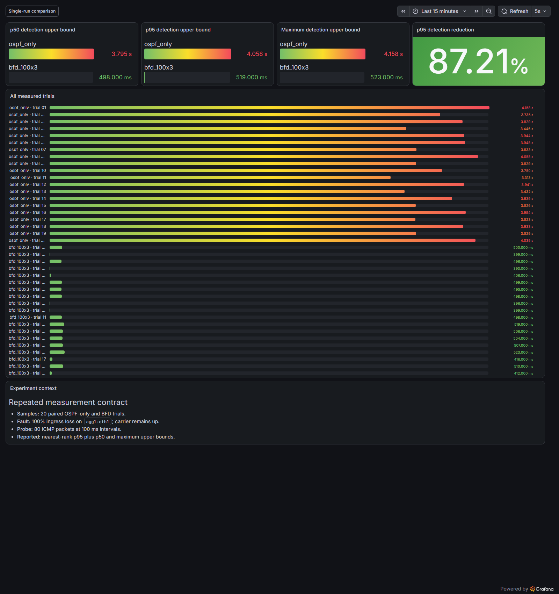
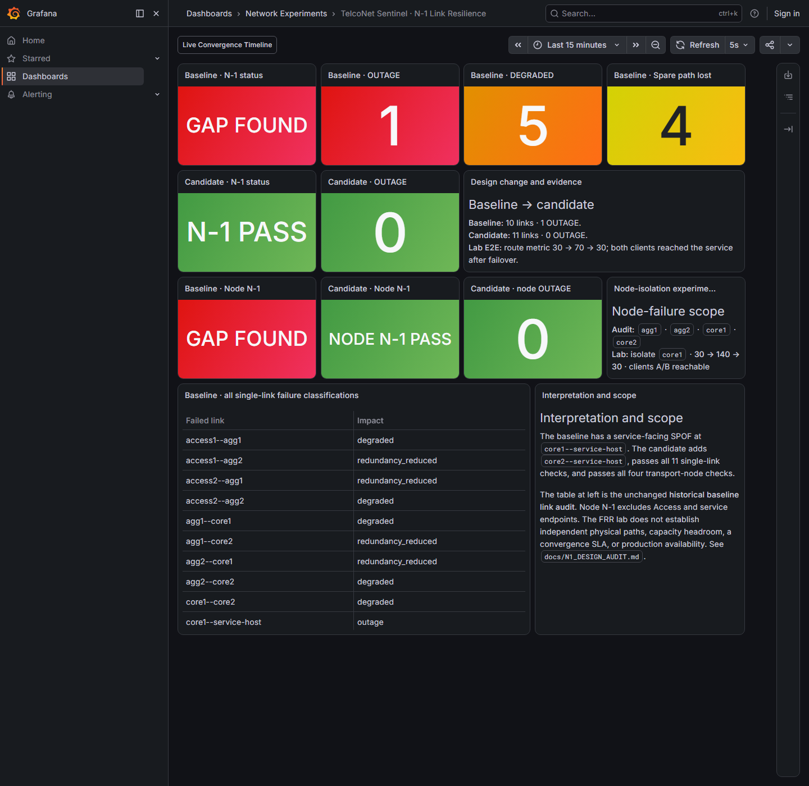
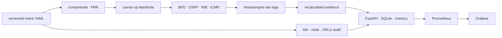

# TelcoNet Sentinel

[](https://github.com/teriyakki-jin/telconet-sentinel/actions/workflows/validate.yml)
[](https://github.com/teriyakki-jin/telconet-sentinel/actions/workflows/lab-e2e.yml)
[](https://github.com/teriyakki-jin/telconet-sentinel/actions/workflows/codeql.yml)
[](https://scorecard.dev/viewer/?uri=github.com/teriyakki-jin/telconet-sentinel)

이 프로젝트는 OSPF와 BFD 기능을 나열한 실습 모음이 아니라, 하나의 Access–Aggregation–Core 망을 기준으로 장애 탐지와 경로 전환, 서비스 복구, 이중화 설계의 한계를 차례로 검증한 네트워크 복원력 랩이다.

FRRouting 라우터 6대를 containerlab으로 구성하고, 링크 carrier는 살아 있지만 패킷만 사라지는 원격 블랙홀을 주입했다. OSPF 단독 구성과 BFD 연동 구성을 반복 비교했으며, 이후 링크·노드 N-1과 SRLG 분석으로 범위를 넓혔다. 각 결과는 원시 로그에서 다시 계산할 수 있고 Prometheus와 Grafana에서 확인할 수 있다.

> 이 저장소는 개인 학습용 로컬 시뮬레이션이다. 실제 통신사 망 정보나 운영 데이터는 사용하지 않았으며, 모든 수치는 이 랩의 토폴로지·설정·측정 방식에서 얻은 관측값이다.

## 무엇을 확인했나

이 프로젝트는 한 가지 질문에서 시작했다.

> 라우팅 경로를 의도대로 설계해도, 장애를 늦게 탐지하거나 예비 경로가 같은 위험을 공유하면 서비스 복구를 보장할 수 있는가?

이를 다음 순서로 확인했다.

| 단계 | 확인한 내용 | 결과 |
|---|---|---|
| 1. OSPF 경로 설계 | cost로 정상 경로와 우회 경로를 고정할 수 있는가 | 정상 cost `30`, 우회 cost `140` |
| 2. 장애 탐지 | carrier-up 블랙홀에서 OSPF와 BFD의 탐지 차이는 얼마인가 | BFD p95 탐지 상한 `519ms`, OSPF `4,058ms` |
| 3. 수렴 과정 | 장애부터 data plane 복구까지 어떤 순서로 상태가 바뀌는가 | BFD → OSPF → RIB → ICMP 순서 확인 |
| 4. 설계 복원력 | 모든 단일 링크·전송 노드 장애를 우회할 수 있는가 | 서비스 이중화 후보가 링크·노드 N-1 통과 |
| 5. 공유 위험 | N-1을 통과한 설계도 복합 장애에서 안전한가 | `service-entry` SRLG에서 outage 확인 |

즉, 이 프로젝트의 핵심은 “BFD가 빠르다”에서 끝나지 않는다. 빠른 탐지, 올바른 경로 설계, 실제 도달성, 공유 위험을 같은 실험 체계 안에서 연결했다.

## 핵심 결과

### OSPF-only와 BFD 반복 비교

OSPF-only와 BFD 구성을 각각 20회 실행했다. 매 회차마다 정상 metric `30`을 확인한 뒤 동일한 인터페이스에 블랙홀을 주입했다.

| 탐지 결과 | OSPF only | BFD 100ms × 3 | 개선 |
|---|---:|---:|---:|
| p50 상한 | 3,794.5ms | 498ms | 86.88% 단축 |
| p95 상한 | 4,058ms | 519ms | 87.21% 단축 |
| 최대 상한 | 4,158ms | 523ms | 87.42% 단축 |
| 전환 전 손실 p95 | 37 packets | 3 packets | 34 packets 감소 |
| 표본 | 20회 | 20회 | 총 40회 |



### 수렴 타임라인

한 번의 장애에서는 control plane과 data plane의 상태 변화를 100ms 간격으로 수집했다.

```text
blackhole_injected
  → bfd_down
  → ospf_neighbor_down
  → route_failover (metric 30 → 140)
  → data_plane_recovered
```

[main containerlab E2E run](https://github.com/teriyakki-jin/telconet-sentinel/actions/runs/34012546439)에서 확인한 관측 상한은 다음과 같다.

| 결과 | 관측 상한 |
|---|---:|
| 장애 주입 → BFD·OSPF Down 및 backup metric `140` 확인 | 799ms |
| 장애 주입 → 최초 ICMP 응답 확인 | 1,080ms |

이 값은 프로토콜 내부 처리시간이나 실서비스 SLA가 아니다. FRR 10.7.0, BFD 100ms × 3, 해당 OSPF 설정과 100ms polling 조건에서 수집기가 상태를 확인한 시점의 상한이다. Prometheus의 1초 scrape 표본으로 sub-second 수렴 시간을 계산하지 않았다.

### N-1과 공유위험 분석

초기 설계에서는 `core1--service-host`가 단일 장애점이었다. `core2--service-host`를 추가한 후보 설계를 만들고 같은 감사 엔진으로 다시 계산했다.

| 검증 | 초기 설계 | 서비스 이중화 후보 |
|---|---:|---:|
| 단일 링크 | 10개 중 `OUTAGE` 1개 | 11개 모두 서비스 경로 유지 |
| 전송 노드 | `core1` 제거 시 서비스 단절 | `agg1`, `agg2`, `core1`, `core2` 각각 제거해도 경로 유지 |
| 선언된 SRLG | 미검증 | `service-entry` 동시 단절에서 `OUTAGE` |

N-1 통과는 물리적으로 독립된 두 경로를 증명하지 않는다. 그래서 `failure-domains.yml`에 함께 소실될 링크와 노드를 선언하고 복합 장애로 다시 계산했다.

| Failure Domain | 장애 범위 | 결과 |
|---|---|---|
| `primary-site-power` | `agg1`, `core1` 동시 손실 | `DEGRADED`, access1 cost `30 → 140` |
| `service-entry` | 두 service-facing 링크 동시 단절 | `OUTAGE`, 두 Access 모두 unreachable |



## OSPF 망 설계

모든 라우터는 Area 0에 두었다. 자동 cost 대신 primary `10`, backup `100`, inter-core `20`을 직접 지정해 실험마다 같은 경로가 선택되도록 했다.

```text
================================================================================
                         OSPF Area 0 Network Architecture
================================================================================

             [ Service Network · 10.20.0.0/24 · Passive ]
                                   │
                                   ▼
         ┌──────────────────┐   Cost 20   ┌──────────────────┐
         │  core1 · .0.31   ├─────────────┤  core2 · .0.32   │
         └─────┬────────┬───┘             └───┬────────┬─────┘
    Primary 10 │        ╲ Backup 100  Backup 100 ╱        │ Primary 10
               ▼         ╲                   ╱         ▼
         ┌──────────────────┐             ┌──────────────────┐
         │  agg1 · .0.21    │             │  agg2 · .0.22    │
         └─────┬────────┬───┘             └───┬────────┬─────┘
    Primary 10 │        ╲ Backup 100  Backup 100 ╱        │ Primary 10
               ▼         ╲                   ╱         ▼
         ┌──────────────────┐             ┌──────────────────┐
         │ access1 · .0.11  │             │ access2 · .0.12  │
         └──────────────────┘             └──────────────────┘

Router-ID: 10.255.0.x/32 · Transit: /31 point-to-point
```

access1 기준 경로는 다음과 같다.

```text
정상 경로  : access1 → agg1 → core1 → service
OSPF cost  : 10 + 10 + 10 = 30

장애 우회  : access1 → agg2 → core2 → core1 → service
OSPF cost  : 100 + 10 + 20 + 10 = 140
```

| 설계 선택 | 이유 |
|---|---|
| Single Area 0 | multi-area 변수를 제외하고 장애 탐지와 수렴에 집중 |
| `/31` point-to-point | transit 주소 절약, DR/BDR 선출이 필요 없는 링크로 명시 |
| Loopback `/32` router-id | 물리 인터페이스와 분리된 라우터 식별자 사용 |
| Passive customer/service interface | prefix는 광고하되 단말과 adjacency를 맺지 않음 |
| Explicit cost 10/100/20 | primary/backup 정책을 결정론적으로 검증 |
| BFD는 탐지에만 사용 | OSPF 경로 정책을 유지한 채 탐지 시간만 비교 |

주소 계획과 인터페이스별 설정은 [OSPF 설계 문서](docs/OSPF_DESIGN.md)에 정리했다.

## 실험 방법

### 블랙홀 장애

`agg1:eth1`의 carrier는 유지하고 ingress 패킷만 100% 차단한다. 물리 링크 Down 이벤트에 의존하지 않고 hello/dead timer와 BFD의 차이를 확인하기 위한 조건이다.

| 항목 | 설정 |
|---|---|
| OSPF only | hello 1초, dead 4초 |
| BFD | minimum TX/RX 100ms, multiplier 3 |
| Probe | 100ms 간격 ICMP 80개, `ping -D` epoch timestamp |
| 수렴 조건 | 서비스 경로 metric `140`, traceroute 우회 경로 관측 |
| 반복 횟수 | 프로필별 20회 |
| 통계 | median p50, nearest-rank p95, maximum |

### Evidence 재계산

README의 숫자를 대시보드에서 수기로 옮기지 않았다. 원시 로그를 다시 파싱해 JSON evidence를 만들고, 테스트에서 같은 값을 재계산한다.

```text
40개 원시 로그
  → timestamp·ping sequence·TTL·route metric 파싱
  → p50·p95·max 계산
  → topology·FRR 설정 SHA-256 검증
  → evidence/bfd-repeated-trials.json
  → FastAPI /metrics
  → Prometheus · Grafana
```

- [40개 원시 로그](evidence/repeated)
- [반복 실험 JSON](evidence/bfd-repeated-trials.json)
- [실험 자동화 스크립트](scenarios/bfd_repeated_trials_lab.sh)
- [집계 구현](src/telconet_sentinel/repeated_trials.py)

## 프로젝트 구조

네트워크 실험과 분석 코드는 다음 흐름으로 연결된다.


```mermaid
flowchart LR
    INTENT["versioned intent YAML"] --> LAB["containerlab · FRR"]
    INTENT --> AUDIT["link · node · SRLG audit"]
    LAB --> FAULT["carrier-up blackhole"]
    FAULT --> OBSERVE["BFD · OSPF · RIB · ICMP"]
    OBSERVE --> RAW["timestamped raw logs"]
    RAW --> EVIDENCE["recalculated evidence"]
    EVIDENCE --> API["FastAPI · SQLite · /metrics"]
    AUDIT --> API
    API --> PROM["Prometheus"]
    PROM --> GRAFANA["Grafana"]
```

| 계층 | 역할 |
|---|---|
| `intent.py` | versioned YAML 검증과 `Topology` 생성 |
| `fault.py` | 링크·노드·복합 장애를 공통 `FaultScenario`로 표현 |
| `audit.py` | 정상 경로와 장애 후 경로를 비교해 `FaultAuditResult` 생성 |
| `failure_domain.py` | 선언된 SRLG 검증과 복합 장애 계산 |
| `resilience.py` | 링크·노드 N-1 결과를 API와 Prometheus 형식으로 변환 |
| convergence collector | FRR JSON과 ICMP를 monotonic clock으로 수집 |

링크·노드·SRLG 분석은 같은 경로 계산 코드를 사용한다. API는 Docker socket이나 container 명령에 접근하지 않고, 수집기가 전송한 typed event와 계산된 결과만 저장한다. 자세한 경계는 [시스템 아키텍처 문서](docs/ARCHITECTURE.md)에서 설명한다.

## 실행

### 대시보드와 API

```bash
docker compose up -d --build
```

| 서비스 | URL |
|---|---|
| Network overview | `http://127.0.0.1:3000/d/telconet-network-overview` |
| BFD 반복 비교 | `http://127.0.0.1:3000/d/telconet-bfd-repeated-trials` |
| Live convergence | `http://127.0.0.1:3000/d/telconet-live-convergence` |
| N-1 resilience | `http://127.0.0.1:3000/d/telconet-n1-resilience` |
| Shared-risk resilience | `http://127.0.0.1:3000/d/telconet-srlg-resilience` |
| Prometheus | `http://127.0.0.1:9090` |
| API docs | `http://127.0.0.1:18000/docs` |

모든 포트는 loopback에만 연다. Grafana dashboard와 datasource는 파일로 provisioning하고 anonymous read-only viewer로 실행한다.

```bash
docker compose down
```

### Python 환경과 테스트

```powershell
python -m venv .venv
.venv\Scripts\Activate.ps1
python -m pip install -e ".[dev]"
pytest -q --cov=telconet_sentinel --cov-branch --cov-fail-under=80
uvicorn telconet_sentinel.main:app --reload
```

### containerlab 실험

containerlab은 Linux network namespace를 사용하므로 Windows에서는 WSL2에서 실행한다.

```bash
python -m pip install -e .
bash scenarios/link_failure_lab.sh
bash scenarios/bfd_comparison_lab.sh
bash scenarios/bfd_repeated_trials_lab.sh
bash scenarios/live_convergence_e2e.sh
bash scenarios/dual_homing_e2e.sh
```

반복 횟수는 `TELCONET_TRIALS`로 20~30회 범위에서 바꿀 수 있다. Live E2E는 랩 배포, 장애 주입, 수렴 수집, evidence 검증과 정리까지 수행한다.

## 검증

| 계층 | 확인하는 것 |
|---|---|
| Unit | intent 검증, fault engine, path cost, OSPF/BFD 파싱, N-1·SRLG 계산, SQLite 보존성 |
| API | 제한된 입력 모델, 감사 결과, event 조회, 승인 상태, Prometheus metrics |
| Contract | intent–containerlab 링크, FRR 설정, dashboard, alert rule, E2E workflow 일치 |
| Integration | 원시 로그에서 evidence 재계산, configuration fingerprint 일치 |
| Lab E2E | 실제 FRR blackhole 수렴, 서비스 이중화, core1 격리, ICMP 복구 |
| Static·Security | Ruff, strict mypy, Bash syntax, CodeQL |
| CI | branch coverage 80% gate, promtool rule test, containerlab E2E |

## 범위와 한계

- Single Area 0만 다루며 multi-area, BGP, MPLS L3VPN은 포함하지 않는다.
- 수렴 값은 로컬 containerlab과 100ms polling에서 얻은 관측 상한이다.
- 선언한 failure domain은 분석 가정이며 실제 관로·전원 분리를 조사한 결과가 아니다.
- N-1 통과는 capacity headroom, 무손실 전환, 물리 경로 독립성을 보장하지 않는다.
- OSPF authentication, 장기 부하, 장비 vendor 간 interoperability는 검증하지 않았다.
- Prometheus alert는 로컬 상태 지속 여부를 확인하며 Alertmanager와 on-call 연동은 포함하지 않는다.
- SQLite는 최근 수렴 run 20개만 보관하며 장기 시계열 저장소가 아니다.

## 저장소와 문서

```text
telconet-sentinel/
├── lab/                       # containerlab topology, intent, FRR 설정
├── scenarios/                 # 장애·반복·live E2E 자동화
├── evidence/                  # 원시 로그와 재계산된 JSON
├── src/telconet_sentinel/     # topology, fault audit, API, parser, metrics
├── observability/             # Prometheus와 Grafana provisioning
├── tests/                     # unit·API·contract·integration tests
└── docs/                      # 설계 문서와 runbook
```

- [OSPF 설계](docs/OSPF_DESIGN.md)
- [N-1 링크·노드 설계 감사](docs/N1_DESIGN_AUDIT.md)
- [SRLG·Failure Domain 설계 감사](docs/SRLG_DESIGN_AUDIT.md)
- [Intent schema와 fault model](docs/INTENT_MODEL.md)
- [시스템 아키텍처와 신뢰 경계](docs/ARCHITECTURE.md)
- [링크 장애 실험 Runbook](docs/RUNBOOK_LINK_FAILURE.md)
- [수렴 상태와 알림 Runbook](docs/RUNBOOK_ALERTS.md)

기술 스택은 containerlab 0.79.0, FRRouting 10.7.0, Python, FastAPI, Pydantic, Prometheus 3.14.0, Grafana 13.1.0, Docker와 GitHub Actions이다. BFD와 OSPF 설정은 [FRRouting BFD 문서](https://docs.frrouting.org/en/latest/bfd.html)와 [FRRouting OSPF 문서](https://docs.frrouting.org/en/latest/ospfd.html)를 참고했다.
