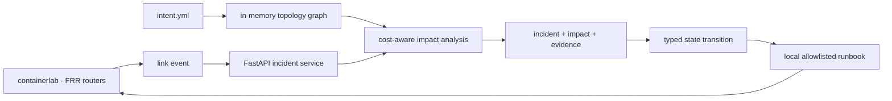
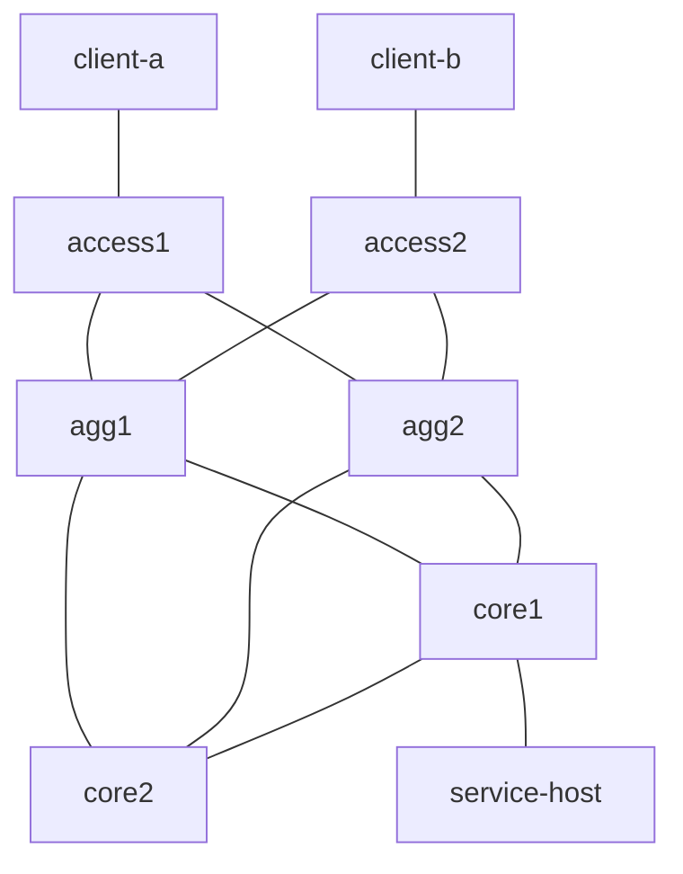

# Architecture

## Design goal

TelcoNet Sentinel separates the network lab, analysis logic, and recovery execution boundary. The API analyzes an event and creates a typed recovery proposal, but it does not receive or execute arbitrary shell commands.

## Trust boundaries

- The API accepts `event_type`, `link_id`, and an optional timestamp.
- Only topology link identifiers are valid recovery targets.
- Only `restore_link` is allowed in Phase 1.
- The Phase 1 approval endpoint has no operator identity; it changes local typed state only.
- The local runbook owns privileged lab commands and is not invoked by the API.
- The API container does not mount the Docker socket.

## Topology

All router links participate in OSPF area 0. Interface costs create explicit primary and backup paths. The customer-facing `/24` networks are advertised from passive access interfaces.

## Phase boundaries

- Phase 1: OSPF cost-aware impact analysis, typed recovery state, scenario evidence.
- Phase 2: BFD and FRR syslog collection, measured convergence comparison.
- Phase 3: BGP/MPLS L3VPN and streaming telemetry.
