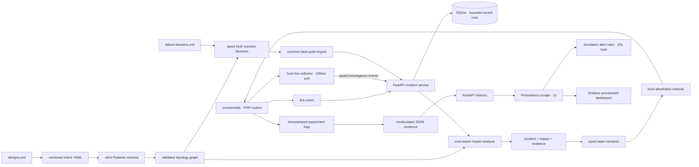
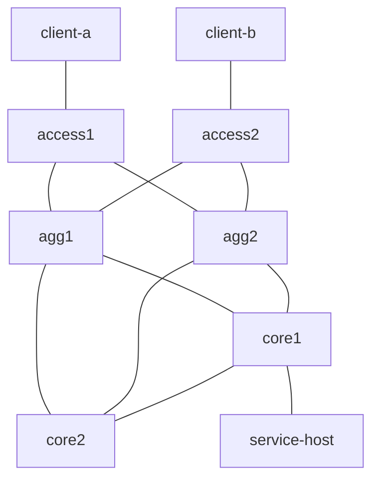

# Architecture

## Design goal

TelcoNet Sentinel separates the network lab, analysis logic, and recovery execution boundary. The API analyzes an event and creates a typed recovery proposal, but it does not receive or execute arbitrary shell commands.

```mermaid
flowchart LR
    CLAB["containerlab · FRR routers"] --> EVENT["link event"]
    EVENT --> API["FastAPI incident service"]
    CLAB --> COLLECTOR["host live collector · 100ms poll"]
    COLLECTOR -->|"typed convergence events"| API
    API --> STORE[("SQLite · bounded recent runs")]
    CATALOG["designs.yml"] --> INTENT["versioned intent YAML"]
    INTENT --> SCHEMA["strict Pydantic schema"]
    SCHEMA --> GRAPH["validated topology graph"]
    GRAPH --> IMPACT["cost-aware impact analysis"]
    GRAPH --> FACTORY["typed fault scenario factories"]
    DOMAINS["failure-domains.yml"] --> FACTORY
    FACTORY --> N1["common fault audit engine"]
    N1 --> API
    API --> IMPACT
    IMPACT --> INCIDENT["incident + impact + evidence"]
    INCIDENT --> APPROVAL["typed state transition"]
    APPROVAL --> RUNBOOK["local allowlisted runbook"]
    RUNBOOK --> CLAB
    CLAB --> RAW["timestamped experiment logs"]
    RAW --> EVIDENCE["recalculated JSON evidence"]
    EVIDENCE --> METRICS["FastAPI /metrics"]
    METRICS --> PROM["Prometheus scrape · 1s"]
    PROM --> RULES["simulation alert rules · 20s hold"]
    PROM --> GRAFANA["Grafana provisioned dashboard"]
```

## Analysis boundaries

The analysis path has five explicit layers:

1. `intent.py` rejects malformed or ambiguous YAML before domain objects exist.
2. `Topology` owns graph identity and weighted path calculation, including sets of excluded links and nodes.
3. `fault.py` declares immutable link, node, and composite fault scenarios.
4. `audit.py` owns the single reachability and cost-comparison algorithm. `resilience.py` only adapts its results to the established link/node API and metric contracts.
5. `failure_domain.py` validates declared shared-risk groups and adapts their composite faults, access-path costs, API output, and bounded-label metrics.

`lab/designs.yml` declares which intent is the historical baseline and which is a candidate. This sidecar keeps the relationship explicit without changing `lab/intent.yml`, whose bytes are part of the checked-in 40-trial evidence fingerprint.

## Trust boundaries

- The API accepts `event_type`, `link_id`, and an optional timestamp.
- Only topology link identifiers are valid recovery targets.
- Only `restore_link` is allowed in Phase 1.
- The Phase 1 approval endpoint has no operator identity; it changes local typed state only.
- The local runbook owns privileged lab commands and is not invoked by the API.
- The host collector owns `docker exec`, reads FRR JSON and continuous ICMP, and sends only typed event fields to the API.
- The API container does not mount the Docker socket.
- Live event offsets use a monotonic clock and represent polling-based observation upper bounds.
- The API writes only validated typed convergence fields to a local SQLite volume; no SQL or file path is accepted from an API request.
- Alert rules are local simulation guardrails, not production SLOs, and no Alertmanager receiver is configured.

## Topology

```mermaid
flowchart TB
    CA[client-a] --- A1[access1]
    CB[client-b] --- A2[access2]
    A1 --- G1[agg1]
    A1 --- G2[agg2]
    A2 --- G1
    A2 --- G2
    G1 --- C1[core1]
    G1 --- C2[core2]
    G2 --- C1
    G2 --- C2
    C1 --- C2
    C1 --- SVC[service-host]
```

All router links participate in OSPF area 0. Interface costs create explicit primary and backup paths. The customer-facing `/24` networks are advertised from passive access interfaces.

## Phase boundaries

- Phase 1: OSPF cost-aware impact analysis, typed recovery state, scenario evidence.
- Phase 2: completed BFD remote-failure comparison and Prometheus-compatible evidence metrics.
- Phase 3: completed live BFD/OSPF/RIB/ICMP convergence timeline and containerlab E2E CI.
- Phase 4a: completed bounded SQLite event persistence and promtool-tested local alert evaluation.
- Phase 4b: Alertmanager delivery, BGP/MPLS L3VPN, distributed event storage, and streaming telemetry.
- Phase 5a: completed deterministic N-1 single-link audit and Grafana scenario matrix.
- Phase 5b: completed service dual-homing design and transport-node failure audit.
- Phase 5c: completed strict shared-risk failure-domain modeling, cost-aware composite audit, API, metrics, and Grafana matrix.
- Foundation 1: completed strict versioned intent/catalog validation and a common multi-component fault audit engine.
