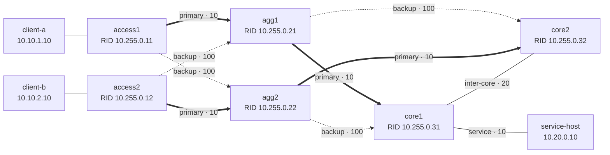

# OSPF 설계

이 문서는 TelcoNet Sentinel 랩의 OSPF 토폴로지와 cost 정책이 어떤 의도로 구성됐는지 설명합니다. 기준 구성은 [`lab/intent.yml`](../lab/intent.yml)과 [`lab/frr`](../lab/frr)이며, 문서에 적힌 값은 계약 테스트로 함께 검증합니다.

## 설계 목표

- Access–Aggregation–Core 계층을 이중화하되 정상 경로는 하나로 결정한다.
- primary 장애 시 별도의 수동 조작 없이 backup 경로로 수렴한다.
- carrier-down뿐 아니라 링크 상태가 살아 있는 패킷 블랙홀도 OSPF/BFD로 비교한다.
- 주소와 cost를 명시적으로 관리해 경로 선택을 계산하고 설명할 수 있게 한다.
- 실험의 초점을 수렴 시간에 두기 위해 모든 라우터를 single Area 0에 배치한다.

## 논리 토폴로지와 cost



cost는 링크 대역폭에서 자동 계산하지 않고 모든 transit 양 끝에 같은 값으로 명시했습니다.

| 역할 | OSPF cost | 설계 의도 |
|---|---:|---|
| Primary access/aggregation 링크 | 10 | 정상 트래픽이 지정된 aggregation으로 진입 |
| Backup access/aggregation 링크 | 100 | primary가 사라질 때만 선택 |
| Core 간 링크 | 20 | core2가 core1 뒤 서비스망에 도달하는 경로 |
| Service network | 10 | `10.20.0.0/24`의 마지막 OSPF hop |

## 주소 계획

transit 링크는 주소 낭비와 broadcast 동작을 줄이기 위해 `/31`과 OSPF `point-to-point` network type을 사용합니다. Loopback `/32`는 장비의 안정적인 router-id이며, 가입자와 서비스 prefix는 passive interface로 광고해 단말과 OSPF adjacency를 맺지 않습니다.

| 구간 | Prefix | Endpoint |
|---|---|---|
| access1–agg1 | `10.0.1.0/31` | `.0` / `.1` |
| access1–agg2 | `10.0.1.2/31` | `.2` / `.3` |
| access2–agg1 | `10.0.1.4/31` | `.4` / `.5` |
| access2–agg2 | `10.0.1.6/31` | `.6` / `.7` |
| agg1–core1 | `10.0.2.0/31` | `.0` / `.1` |
| agg1–core2 | `10.0.2.2/31` | `.2` / `.3` |
| agg2–core1 | `10.0.2.4/31` | `.4` / `.5` |
| agg2–core2 | `10.0.2.6/31` | `.6` / `.7` |
| core1–core2 | `10.0.2.8/31` | `.8` / `.9` |
| Customer A | `10.10.1.0/24` | gateway `10.10.1.1` |
| Customer B | `10.10.2.0/24` | gateway `10.10.2.1` |
| Service | `10.20.0.0/24` | gateway `10.20.0.1` |

| Router | Router ID / Loopback |
|---|---|
| access1 | `10.255.0.11/32` |
| access2 | `10.255.0.12/32` |
| agg1 | `10.255.0.21/32` |
| agg2 | `10.255.0.22/32` |
| core1 | `10.255.0.31/32` |
| core2 | `10.255.0.32/32` |

## 경로 선택 계산

`client-a`가 서비스망에 접근할 때 `access1`이 보는 정상 최단 경로는 다음과 같습니다.

```text
access1 → agg1 → core1 → service
10 + 10 + 10 = 30
```

`access1–agg1` 링크가 사라지거나 OSPF adjacency가 내려가면 backup uplink를 사용합니다.

```text
access1 → agg2 → core2 → core1 → service
100 + 10 + 20 + 10 = 140
```

따라서 실험은 `show ip route 10.20.0.0/24`에서 metric 30을 baseline, metric 140을 failover 완료 조건으로 사용합니다. traceroute는 정상 4-hop 경로가 장애 후 5-hop 경로로 바뀌는지를 함께 남깁니다.

| 장애 | 예상 경로 | 예상 cost | 영향 |
|---|---|---:|---|
| 없음 | access1–agg1–core1–service | 30 | Primary 사용 |
| access1–agg1 장애 | access1–agg2–core2–core1–service | 140 | 서비스 유지, 경로 품질 저하 |
| agg1–core1 장애 | agg1–core2 또는 agg2–core2 경유 | 140 | 동일 cost 우회 후보 존재 |
| access1의 두 uplink 장애 | 경로 없음 | - | Customer A outage |

## 인접성과 장애 탐지

- Transit interface: OSPF point-to-point, hello 1초 / dead 4초
- Baseline OSPF-only: dead timer로 carrier-up 블랙홀 탐지
- BFD profile: minimum TX/RX 100ms, detect multiplier 3
- Customer·service·loopback interface: passive, prefix만 광고

BFD는 OSPF의 경로 선택 정책을 바꾸지 않습니다. 동일한 cost와 backup 경로를 유지하면서 인접 장애를 OSPF dead timer보다 빠르게 전달하는 탐지 계층으로만 사용합니다.

## 범위와 한계

- Single Area 0은 이 소규모 랩의 수렴 실험을 단순화하기 위한 선택이며, 상용망 규모의 multi-area 설계를 대표하지 않습니다.
- 서비스망은 core1에만 연결되어 있어 service-facing link와 core1 자체는 이 랩의 단일 장애점입니다.
- cost는 지연이나 실제 회선 대역폭 측정값이 아니라 primary/backup 정책을 재현하기 위한 상대값입니다.
- 재분배, ECMP 세부 튜닝, OSPF authentication, graceful restart는 현재 범위에 포함하지 않았습니다.

실행과 검증 방법은 [링크 장애 Runbook](RUNBOOK_LINK_FAILURE.md), 실측 분포는 [README](../README.md#20회-반복-실험)에서 확인할 수 있습니다.
